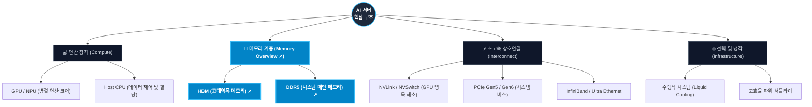

## 🥧 Section 1. 글로벌 AI 가속기 시장 점유율 (Market Share)

AI 서버의 핵심 원가와 성능을 좌우하는 AI 연산 칩(GPU/NPU 등 가속기) 시장의 주요 플레이어 점유율입니다. 

  <h4 class="chart-title">2026 글로벌 AI 가속기(GPU/NPU) 시장 점유율 (추정치)</h4>
  

    <svg width="200" height="200" viewBox="0 0 100 100" class="pie-chart-svg">
      <circle cx="50" cy="50" r="25" fill="none" stroke="#76b900" stroke-width="50" stroke-dasharray="133.52 157.08" stroke-dashoffset="0" />
      <circle cx="50" cy="50" r="25" fill="none" stroke="#ED1C24" stroke-width="50" stroke-dasharray="15.71 157.08" stroke-dashoffset="-133.52" />
      <circle cx="50" cy="50" r="25" fill="none" stroke="#4285F4" stroke-width="50" stroke-dasharray="4.71 157.08" stroke-dashoffset="-149.23" />
      <circle cx="50" cy="50" r="25" fill="none" stroke="#FF9900" stroke-width="50" stroke-dasharray="3.14 157.08" stroke-dashoffset="-153.94" />
    </svg>
    

      
 NVIDIA (85%)

      
 AMD (10%)

      
 Google (3%)

      
 AWS & 기타 (2%)

    

  

👇 **아래 기업 버튼을 클릭하시면 [Step 3. 주요 기업별 로드맵] 페이지로 이동하여 상세 전략을 확인할 수 있습니다.**

  <a href="/nvidia-roadmap" style="padding: 10px 20px; background-color: #76b900; color: white; border-radius: 6px; text-decoration: none; font-weight: bold; cursor: pointer; text-align: center;" class="custom-btn">NVIDIA 로드맵</a>
  <a href="/amd-roadmap" style="padding: 10px 20px; background-color: #ED1C24; color: white; border-radius: 6px; text-decoration: none; font-weight: bold; cursor: pointer; text-align: center;" class="custom-btn">AMD 로드맵</a>
  <a href="/google-roadmap" style="padding: 10px 20px; background-color: #4285F4; color: white; border-radius: 6px; text-decoration: none; font-weight: bold; cursor: pointer; text-align: center;" class="custom-btn">Google (TPU)</a>
  <a href="/aws-roadmap" style="padding: 10px 20px; background-color: #FF9900; color: white; border-radius: 6px; text-decoration: none; font-weight: bold; cursor: pointer; text-align: center;" class="custom-btn">AWS (Trainium)</a>

---

## 📈 Section 2. AI 서버 시장 규모 및 성장률 (Market Size)

글로벌 AI 서버 출하량 및 가치 성장 추이입니다. (막대에 마우스를 올리면 상세 수치가 표시됩니다.)

  <!-- 2023 -->
  

    
$45B

    

    
2023

  

  <!-- 2024 -->
  

    
$98B

    

    
2024

  

  <!-- 2025 -->
  

    
$150B

    

    
2025

  

  <!-- 2026 -->
  

    
$210B

    

    
2026

  

  <!-- 2027 -->
  

    
$280B

    

    
2027(E)

  

  <!-- 2028 -->
  

    
$360B

    

    
2028(E)

  

  <!-- 2029 -->
  

    
$450B

    

    
2029(E)

  

  <!-- 2030 -->
  

    
$550B

    

    
2030(E)

  

> **Insight:** 2023년 초거대 LLM의 등장 이후 생성형 AI 시장이 개화하면서 AI 서버 시장은 매년 급격히 팽창하고 있습니다. 특히 2026년 현재는 학습뿐만 아니라 실시간 서빙을 위한 '추론(Inference)' 수요가 시장을 강력하게 견인 중이며, 2030년까지 지속적인 고도성장이 전망됩니다.
---

## 🧠 Section 3. AI 서버 하드웨어 아키텍처 (Hardware Structure)

단일 AI 서버 랙(Rack) 내부에 구성되는 핵심 하드웨어 컴포넌트 구조입니다. **메모리 계층(Memory)** 노드 및 아래 버튼을 클릭하시면 상세 [Memory Overview](/memory-overview) 페이지로 이동합니다.

  <a href="/memory-overview" style="padding: 12px 24px; background-color: #0284c7; color: white; border-radius: 8px; text-decoration: none; font-weight: bold; display: inline-flex; align-items: center; gap: 8px; box-shadow: 0 4px 14px rgba(2, 132, 199, 0.4);" class="custom-btn">
    💾 Memory Overview (DRAM/NAND 시장 및 기술 로드맵) 분석 이동 ↗
  </a>

