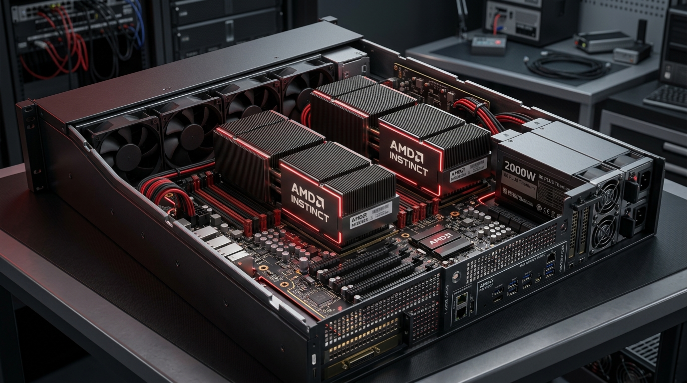

# 🔴 AMD Instinct 가속기 플랫폼 로드맵

AMD는 업계 최대 용량의 초고속 HBM 메모리 탑재와 개방형 소프트웨어 생태계(ROCm)를 기치로 삼아, NVIDIA 독점 구도인 AI 가속기 시장에서 가장 강력하고 실질적인 대안으로 자리매김하고 있습니다.

---

## 1. 대표 플랫폼 이미지
대용량 HBM 메모리 적층 기술이 탑재된 차세대 **AMD Instinct MI300X/MI325X OAM 연산 노드**입니다.

---

## 2. AMD Instinct 가속기 로드맵 요약

| 출시 시점 | 제품 세대명 | 아키텍처명 | HBM 사양 | 연산 대역폭 및 성능 특징 |
| :--- | :--- | :--- | :--- | :--- |
| **2023** | **Instinct MI300X** | CDNA 3 | 192GB HBM3 | 업계 최초로 192GB 대용량을 제공하여 단일 가속기에서의 거대 모델 추론 최적화. |
| **2024 H2** | **Instinct MI325X** | CDNA 3 개량 | **256GB HBM3e** | 256GB HBM3e 메모리를 탑재하여 대용량 가치 극대화, 초당 6.0TB 대역폭 달성. |
| **2025 (E)** | **Instinct MI350** | **CDNA 4** | HBM3e (용량 증가) | 3nm 미세 공정으로 전환하여 FP4/FP8 연산 효율성 극대화 및 블랙웰 대항마 포지셔닝. |
| **2026 (E)** | **Instinct MI400** | **CDNA 5** | **HBM4 (2048-bit)** | 차세대 HBM4 3D 적층 구조 채택 및 다층 칩렛 패키징 아키텍처 개량. |

---

## 3. 하드웨어 구성 및 Teardown 분석

AMD Instinct 서버 플랫폼(대표 규격: **AMD Gianti 8-GPU Server Chassis**)을 분해 분석한 핵심 사양입니다.

* **칩렛(Chiplet) 설계 극대화:** MI300X/325X는 TSMC의 3D 패키징(SoIC) 기술을 사용해 4개의 I/O 다이(Base Die) 위에 8개의 GPU 연산 다이(Compute Die)를 3차원 적층하고, 그 주변에 HBM 메모리 스택 8개를 배치하는 복합 칩렛 방식을 채택했습니다.
* **마더보드 규격 (UBB & OAM):** OCP(Open Compute Project) 표준 가이드라인에 완벽히 부합하여 설계되었습니다. 따라서 엔비디아의 HGX 기판을 들어내고 AMD의 UBB 기판을 섀시에 바로 교체 장착하는 핀 호환(Pin-compatible) 형태의 호환성을 제공합니다.
* **ROCm 개방형 소프트웨어:** 코드 컴파일 시 CUDA API를 ROCm API로 자동 전환해 주는 개발 툴(HIP)을 제공하여, 기존 AI 엔지니어들의 소프트웨어 전이 비용을 최소화하고 있습니다.
