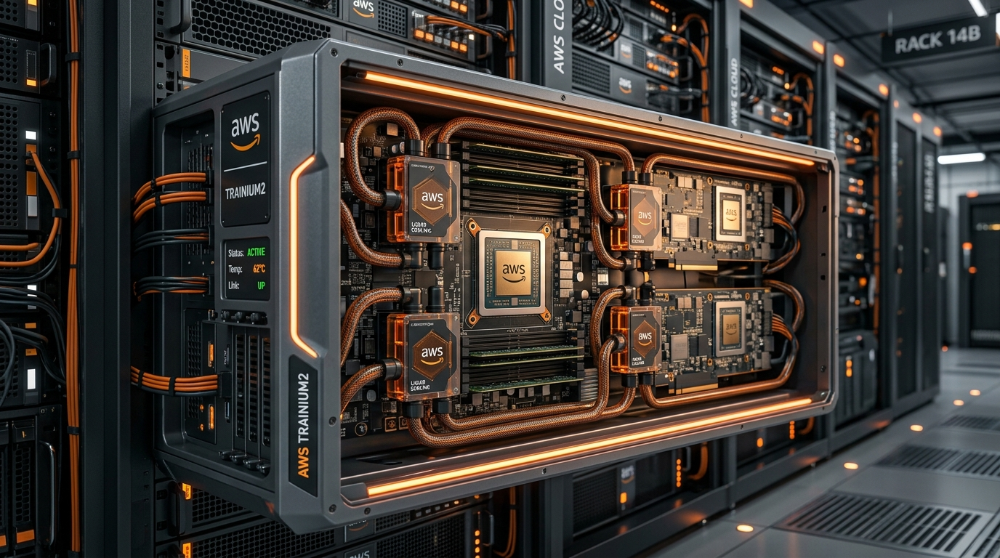

# 🟠 AWS 가속기 및 CPU 플랫폼 로드맵 (Trainium & Graviton)

Amazon Web Services (AWS)는 클라우드 가속기 분야에서 가장 오랜 시간 맞춤형 실리콘(ASIC) 설계 경험을 축적해 왔습니다. 연산 가성비를 위한 **Graviton CPU** 시리즈와 AI 학습용 **Trainium**, 추론용 **Inferentia** 가속기를 병렬로 배치하여 클라우드 하드웨어 지배력을 강화하고 있습니다.

---

## 1. 대표 플랫폼 이미지
클라우드 가상 머신에 고밀도로 연산력을 제공하도록 최적화된 차세대 **AWS Trainium2 / EC2 UltraCluster 가속 노드**입니다.

---

## 2. AWS 커스텀 실리콘 로드맵 요약

### ① AI 연산 가속기 (Trainium & Inferentia)

| 출시 연도 | 가속기 모델명 | 주요 목적 | 메모리 사양 (HBM) | 성능 및 클러스터 특징 |
| :--- | :--- | :--- | :--- | :--- |
| **2021** | **AWS Inferentia2** | AI 모델 추론 특화 | 32GB HBM2 | 지연 시간을 극소화한 실시간 추론 연산 지원, 가성비 위주. |
| **2022** | **AWS Trainium1** | 대규모 AI 모델 학습 | 32GB HBM2 | Neuron SDK와 연계하여 최적의 학습 비용 실현. |
| **2024~2025** | **AWS Trainium2** | 초대형 LLM 학습 | **96GB HBM** | 1세대 대비 연산 성능 4배 향상, **65,000개 칩**을 울트라클러스터로 결합 가능. |

### ② 범용 서버 CPU (AWS Graviton)

| 출시 연도 | CPU 모델명 | CPU 아키텍처 코어 | 메모리 규격 | 주요 특징 및 워크로드 성능 |
| :--- | :--- | :--- | :--- | :--- |
| **2021** | **AWS Graviton3** | ARM Neoverse V1 (64코어) | DDR5 | 기존 Graviton2 대비 연산 성능 25%, 부동소수점 연산 2배 향상. |
| **2024** | **AWS Graviton4** | ARM Neoverse V2 (96코어) | DDR5 | Graviton3 대비 성능 30%, 메모리 대역폭 75% 향상. 범용 서버 비용 절감 지배. |

---

## 3. 하드웨어 구성 및 기술적 차별성

AWS 커스텀 인프라가 지닌 아키텍처 특징입니다.

* **Neuron SDK 밀착 결합:** 
  PyTorch 및 TensorFlow 코드를 AWS 반도체 기계어로 컴파일해 주는 전용 컴파일러 라이브러리(Neuron SDK)를 상시 업데이트하여, 인프라 전환 시 빌드 에러 및 소프트웨어 호환성 마찰을 억제합니다.
* **EC2 UltraCluster 네트워킹:** 
  AWS는 자체 개발한 초지연성 네트워크 인터페이스 카드인 **EFA (Elastic Fabric Adapter)**와 가상화 전용 컨트롤러인 **Nitro System**을 결합하여, 6만 대 이상의 가속기 서버가 단일 공유 광대역 스위치처럼 움직이게 스케일 아웃을 지원합니다.
