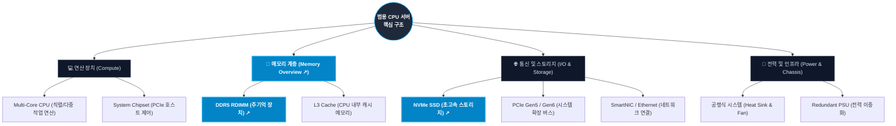

# ⚙️ General Server Overview

일반 서버(범용 CPU 서버)는 전 세계 데이터센터와 클라우드 인프라의 근간을 이루는 전통적 컴퓨팅 시스템입니다. 이 페이지에서는 범용 서버의 핵심 시장 점유율, 시장 규모 및 하드웨어 아키텍처를 다룹니다.

---

## 🥧 Section 1. 글로벌 서버 CPU 시장 점유율 (Market Share)

일반 서버의 연산 성능과 호환성을 결정하는 서버용 CPU 시장의 주요 브랜드별 점유율입니다. (2026년 추정치 기준)

  <h4 class="chart-title">2026 글로벌 서버용 CPU 시장 점유율 (추정치)</h4>
  

    <svg width="200" height="200" viewBox="0 0 100 100" class="pie-chart-svg">
      <!-- Intel: 65% -->
      <circle cx="50" cy="50" r="25" fill="none" stroke="#00c8ff" stroke-width="50" stroke-dasharray="102.1 157.08" stroke-dashoffset="0" />
      <!-- AMD: 30% -->
      <circle cx="50" cy="50" r="25" fill="none" stroke="#ED1C24" stroke-width="50" stroke-dasharray="47.12 157.08" stroke-dashoffset="-102.1" />
      <!-- ARM & Others: 5% -->
      <circle cx="50" cy="50" r="25" fill="none" stroke="#a855f7" stroke-width="50" stroke-dasharray="7.85 157.08" stroke-dashoffset="-149.22" />
    </svg>
    

      
 Intel (65%)

      
 AMD (30%)

      
 ARM 계열 및 기타 (5%)

    

  

👇 **아래 대표 기업 버튼을 클릭하시면 각 CPU/서버 플랫폼 제조사의 상세 로드맵 페이지로 이동합니다.**

  <a href="/intel-roadmap" style="padding: 10px 20px; background-color: #00c8ff; color: white; border-radius: 6px; text-decoration: none; font-weight: bold; cursor: pointer; text-align: center;" class="custom-btn">Intel CPU 로드맵</a>
  <a href="/amd-cpu-roadmap" style="padding: 10px 20px; background-color: #ED1C24; color: white; border-radius: 6px; text-decoration: none; font-weight: bold; cursor: pointer; text-align: center;" class="custom-btn">AMD CPU 로드맵</a>
  <a href="/aws-roadmap" style="padding: 10px 20px; background-color: #FF9900; color: white; border-radius: 6px; text-decoration: none; font-weight: bold; cursor: pointer; text-align: center;" class="custom-btn">AWS Graviton 로드맵</a>
  <a href="/ampere-roadmap" style="padding: 10px 20px; background-color: #a855f7; color: white; border-radius: 6px; text-decoration: none; font-weight: bold; cursor: pointer; text-align: center;" class="custom-btn">Ampere ARM 로드맵</a>

---

## 📈 Section 2. 일반 서버 시장 규모 추이 (Market Size)

글로벌 일반 CPU 서버 시장의 투자 추이입니다. (단위: $B, 10억 달러)

  <!-- 2023 -->
  

    
$110B

    

    
2023

  

  <!-- 2024 -->
  

    
$115B

    

    
2024

  

  <!-- 2025 -->
  

    
$120B

    

    
2025

  

  <!-- 2026 -->
  

    
$125B

    

    
2026

  

  <!-- 2027 -->
  

    
$132B

    

    
2027(E)

  

  <!-- 2028 -->
  

    
$140B

    

    
2028(E)

  

  <!-- 2029 -->
  

    
$150B

    

    
2029(E)

  

  <!-- 2030 -->
  

    
$164B

    

    
2030(E)

  

> **Insight:** 범용 일반 CPU 서버 시장은 AI 서버와 달리 연간 3~5% 내외의 안정적인 성숙기 성장을 나타내고 있습니다. 기존 DB 쿼리 처리, 레거시 서비스 호스팅 및 가상화 서버 요구는 여전히 대다수를 차지하며 점진적으로 고효율 CPU 플랫폼으로 개량 중입니다.

---

## 🧠 Section 3. 일반 서버 하드웨어 아키텍처 (Hardware Structure)

단일 범용 CPU 서버의 핵심 하드웨어 아키텍처 구성 요소 구조입니다. **메모리 계층(Memory)** 노드 및 아래 버튼을 클릭하시면 상세 [Memory Overview](/memory-overview) 페이지로 이동합니다.

  <a href="/memory-overview" style="padding: 12px 24px; background-color: #0284c7; color: white; border-radius: 8px; text-decoration: none; font-weight: bold; display: inline-flex; align-items: center; gap: 8px; box-shadow: 0 4px 14px rgba(2, 132, 199, 0.4);" class="custom-btn">
    💾 Memory Overview (DRAM/NAND 시장 및 기술 로드맵) 분석 이동 ↗
  </a>

