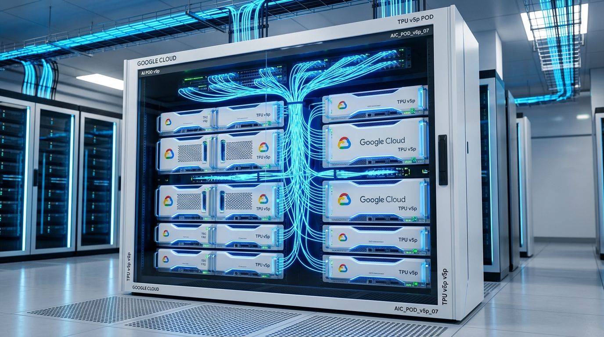

# 🟡 Google TPU 가속기 플랫폼 로드맵

구글은 자체 클라우드 인프라(Google Cloud Platform) 내부에서 사용할 목적으로 설계한 맞춤형 AI 반도체 **TPU (Tensor Processing Unit)** 생태계를 독자적으로 운영하고 있습니다. 거대 인공지능인 Gemini 시리즈는 전적으로 이 TPU 클러스터에서 학습 및 서비스되고 있습니다.

---

## 1. 대표 플랫폼 이미지
구글의 최신 하이퍼스케일 AI 연구용 클러스터인 **Google Cloud TPU v5p Pod** 랙 유닛 시스템입니다.

---

## 2. Google TPU 세대별 로드맵 요약

| 출시 연도 | 가속기 모델명 | 연산 성능 (단일 칩) | 메모리 사양 (HBM) | Pod 클러스터 네트워크 스케일 | 주요 특징 |
| :--- | :--- | :--- | :--- | :--- | :--- |
| **2021** | **TPU v4** | 275 TFLOPS (BF16) | 32GB HBM2 | 4096 칩셋 결합 (3D Torus) | OCS(광 회로 스위치) 기반 물리적 토폴로지 재구성 기술 도입 |
| **2023** | **TPU v5e** | 197 TFLOPS (Int8) | 16GB HBM2e | 256 칩셋 결합 | 비용 효율성에 초점을 맞춘 추론 및 가벼운 학습 특화 모델 |
| **2024** | **TPU v5p** | 459 TFLOPS (BF16) | 95GB HBM2e | **8960 칩셋 결합** (3D Torus) | v4 대비 학습 대역폭 3배 향상, 역대 최대 성능의 훈련용 TPU |
| **2025 (E)** | **TPU v6 (Trillium)** | **v5p 대비 4.7배 연산** | **HBM3 (용량 및 대역폭 증가)** | 256 칩셋 / 확장 클러스터 연계 | MXU(행렬연산장치) 아키텍처 개량, 최고의 전력 효율 달성 |

---

## 3. 하드웨어 구성 및 기술적 차별성

Google TPU 플랫폼이 일반 GPU 서버 플랫폼과 구별되는 독창적인 물리 아키텍처 특징입니다.

* **OCS (Optical Circuit Switch / 광 회로 스위치):** 
  구글은 구리 배선이나 범용 이더넷 스위치 대신, 로봇 미러 광섬유를 사용해 물리적인 빛의 경로를 조절하는 광 회로 스위칭 시스템을 자체 설계했습니다. 이를 통해 소프트웨어 제어만으로 수천 개의 TPU 간 연결 토폴로지를 임의로 변경할 수 있습니다.
* **행렬 연산 장치 (MXU) 특화:** 
  범용 처리를 생략하고 오직 인공신경망 연산의 90% 이상을 차지하는 **이차원 행렬 곱셈(Matrix Multiplication)** 가속에 칩 공간 전체를 집중시켰습니다.
* **통합 수랭식 랙 아키텍처:**
  v4 세대부터 랙 전체에 완전한 액체 냉각(Liquid Cooling) 기술을 조기에 성숙시켰으며, 이를 통해 외부 빌딩 공조 에너지 소비를 극단적으로 절감하고 있습니다.
