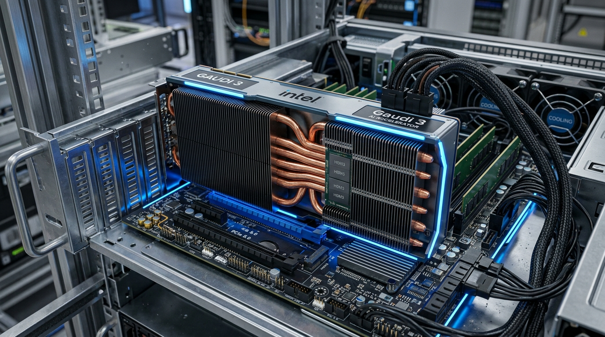

# 🔵 Intel 서버 CPU 및 Gaudi 가속기 로드맵

인텔은 일반 범용 서버 CPU 시장의 절대강자인 **Xeon(제온)** 제품군과, 엔비디아의 독점 구도에 가격 대 성능 비로 정면 추격하는 AI 가속기 **Gaudi(가우디)** 시리즈를 통해 서버 시장 전체를 전방위로 커버하는 기술력을 보유하고 있습니다.

---

## 1. 대표 플랫폼 이미지
파격적인 가성비와 개방형 아키텍처로 설계된 차세대 **Intel Gaudi 3 AI 가속기 범용 베이스보드(UBB) 유닛**입니다.

---

## 2. Intel CPU & 가속기 로드맵 요약

### ① AI 연산 가속기 (Intel Gaudi)

| 출시 연도 | 가속기 모델명 | 연산 성능 (FP8) | HBM 메모리 사양 | 주요 특징 및 네트워킹 구성 |
| :--- | :--- | :--- | :--- | :--- |
| **2022** | **Gaudi 2** | 0.8 PFLOPS | 96GB HBM2e | 7nm 공정 기반. 가격적 이점이 매우 높아 대규모 추론 서비스 도입 활발. |
| **2024** | **Gaudi 3** | **1.8 PFLOPS** | **128GB HBM3** | 5nm 공정 기반. 단일 칩에 24개의 200Gb 이더넷 포트를 내장해 스위치 비용 파격 절감. |
| **2025~2026** | **Falcon Shores** | **MI350 대항** | **HBM3e/HBM4** | Gaudi 기술과 인텔 Xe GPU 아키텍처를 통합한 완전 개량형 차세대 통합 가속기. |

---

### ② 범용 서버 CPU (Intel Xeon) 로드맵 (Clearwater Forest / Diamond Rapids / Coral Rapids 포함)

| 출시 연도 | 세대 및 코드네임 | 최대 코어 수 | 미세 공정 (Node) | 메모리 & 버스 지원 | 주요 아키텍처적 개량 특징 |
| :--- | :--- | :--- | :--- | :--- | :--- |
| **2023** | **4세대 Sapphire Rapids** | 60 코어 (P) | Intel 7 (10nm) | DDR5-4800, PCIe 5.0 | PCIe Gen 5 공식 탑재, CPU 내 AMX AI 가속 블록 첫 탑재. |
| **2023 H2** | **5세대 Emerald Rapids** | 64 코어 (P) | Intel 7 (10nm) | DDR5-5600, PCIe 5.0 | L3 캐시 용량을 전 세대 대비 3배(320MB)로 늘려 DB 성능 최적화. |
| **2024 ~ 2025** | **6세대 Granite Rapids** | **128 코어** (P) | Intel 3 (3nm) | MCR DDR5 (8.8 GT/s), PCIe 5.0 | P-Core 전용. MCRDIMM 도입으로 메모리 대역폭 2배 극대화. |
| **2024 ~ 2025** | **6세대 Sierra Forest** | **288 코어** (E) | Intel 3 (3nm) | DDR5-6400, PCIe 5.0, CXL 2.0 | 고집적 E-Core 전용. 전력 감소 및 클라우드 컨테이너 밀도 극대화. |
| **2025 H2 ~ 2026(E)** | **7세대 Clearwater Forest** | **288 ~ 576 코어** (E) | **Intel 18A (1.8nm)** | **MRDIMM / SOCAMM, PCIe 6.0** | **18A 공정 최초 적용**. RibbonFET GAA & PowerVia 후면 전력 공급. |
| **2026 ~ 2027(E)** | **7세대 Diamond Rapids** | **192 ~ 256 코어** (P) | **Intel 18A / 14A** | **MRDIMM (12.8 GT/s), PCIe 6.0** | P-Core 플래그십. **AMX Gen2 / APX**, CXL 3.0/3.1 메모리 풀링. |
| **2027 ~ 2028(E)** | **8세대 Coral Rapids** | **256+ (P) / 512+ (E)** | **Intel 14A (1.4nm)** | **DDR6 / MRDIMM, PCIe 7.0** | **차세대 High-NA EUV 공정**. 광학 I/O(CPO) 및 CXL 4.0 통합. |

---

## 🚀 Section 3. 차세대 인텔 제온 CPU 3대 플래그십 상세 분석 (시장 예상 스펙)

  <!-- 1. Clearwater Forest -->
  

    

      Intel 18A 최초 적용
      🌲 Clearwater Forest (7세대 E-Core Xeon)
    

    <ul style="font-size: 0.88rem; color: #cbd5e1; line-height: 1.6; padding-left: 18px; margin: 0;">
      <li><strong>출시 예상:</strong> 2025년 하반기 ~ 2026년</li>
      <li><strong>제조 공정:</strong> <strong>Intel 18A (1.8nm급)</strong> 파운드리 공정 (RibbonFET GAA + PowerVia 후면 전치 전력 공급 기술)</li>
      <li><strong>코어 구성:</strong> Darkmont E-Core 아키텍처 기반 <strong>288 ~ 576 코어</strong> (클라우드 네이티브 초고밀도)</li>
      <li><strong>메모리 & I/O:</strong> <strong>MRDIMM / SOCAMM</strong> (8.8~10.7 GT/s), <strong>PCIe Gen 6.0</strong>, CXL 3.0</li>
      <li><strong>시장 타겟:</strong> AWS, Azure, Google Cloud hyperscale 마이크로서비스 및 저전력 고밀도 컨테이너 노드</li>
    </ul>
  

  <!-- 2. Diamond Rapids -->
  

    

      고성능 P-Core 대장주
      💎 Diamond Rapids (7세대 P-Core Xeon)
    

    <ul style="font-size: 0.88rem; color: #cbd5e1; line-height: 1.6; padding-left: 18px; margin: 0;">
      <li><strong>출시 예상:</strong> 2026년 ~ 2027년</li>
      <li><strong>제조 공정:</strong> <strong>Intel 18A / Intel 14A</strong> 선단 공정 + Foveros Direct 3D 패키징</li>
      <li><strong>코어 구성:</strong> Panther Cove P-Core 아키텍처 기반 <strong>192 ~ 256 코어</strong> (싱글 스레드 & 엔터프라이즈 극대화)</li>
      <li><strong>메모리 & I/O:</strong> <strong>MRDIMM (12.8 GT/s)</strong>, <strong>PCIe Gen 6.0 (128+ 레인)</strong>, CXL 3.0 / 3.1 메모리 풀링</li>
      <li><strong>시장 타겟:</strong> AMD Venice(Zen 6 EPYC) 대항마, 엔터프라이즈 AI LLM 미세조정, 차세대 인메모리 DB</li>
    </ul>
  

  <!-- 3. Coral Rapids -->
  

    

      High-NA EUV 차세대
      🪸 Coral Rapids (8세대 통합 Xeon)
    

    <ul style="font-size: 0.88rem; color: #cbd5e1; line-height: 1.6; padding-left: 18px; margin: 0;">
      <li><strong>출시 예상:</strong> 2027년 ~ 2028년</li>
      <li><strong>제조 공정:</strong> 차세대 High-NA EUV 노광 기반 <strong>Intel 14A (1.4nm급)</strong> 공정</li>
      <li><strong>코어 구성:</strong> 256+ P-Core / 512+ E-Core (모듈형 통합 연산 타일 아키텍처)</li>
      <li><strong>메모리 & I/O:</strong> <strong>DDR6 / MRDIMM (12.8 ~ 17.6 GT/s)</strong>, <strong>PCIe Gen 7.0</strong>, <strong>Optical I/O (광학 연결)</strong>, CXL 4.0</li>
      <li><strong>시장 타겟:</strong> 광학 인터커넥트(CPO) 기반 소켓 간 무지연 통신, 차세대 초대형 AI 데이터센터</li>
    </ul>
  

  
💡 인텔 제온 차세대 로드맵 핵심 기술 포인트

  

    • <strong>Intel 18A 공정 분기점:</strong> Clearwater Forest와 Diamond Rapids부터 인텔의 사운를 건 <strong>RibbonFET GAA 트랜지스터</strong>와 <strong>PowerVia 후면 전력 전달 기술</strong>이 본격 도입됩니다. 
    • <strong>메모리 인터페이스 도약:</strong> DDR5 구형 속도 한계를 넘기 위해 차세대 <strong>MRDIMM (12.8 GT/s)</strong> 과 서버용 <strong>SOCAMM</strong>을 표준 탑재합니다. 
    • <strong>PCIe 6.0 & CXL 3.0/4.0:</strong> PAM4 인코딩 PCIe Gen 6.0 버스 및 초고속 광학 I/O (Co-Packaged Optics) 인터페이스가 Coral Rapids 세대에서 차례로 개화할 예정입니다.
  

---

👈 **[General Server Overview로 돌아가기](/general-server-overview)**
