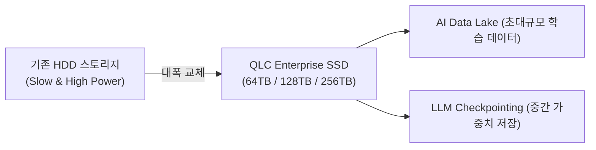

# 💾 NAND Overview (글로벌 NAND Flash 및 eSSD 분석)

서버 데이터베이스, 클라우드 스토리지, AI 학습 데이터 레이크(Data Lake) 및 체크포인팅 스토리지 저장을 전담하는 **NAND Flash & Enterprise SSD (eSSD)** 산업 분석 페이지입니다.

---

## 🥧 Section 1. NAND Flash 글로벌 시장 점유율 (Market Share)

  <!-- Overall NAND Share -->
  

    <h4 class="chart-title">📊 전체 NAND Flash 글로벌 점유율 (2025E)</h4>
    

      <svg width="180" height="180" viewBox="0 0 100 100" class="pie-chart-svg">
        <circle cx="50" cy="50" r="25" fill="none" stroke="#3b82f6" stroke-width="50" stroke-dasharray="50.2 157.08" stroke-dashoffset="0" />
        <circle cx="50" cy="50" r="25" fill="none" stroke="#ef4444" stroke-width="50" stroke-dasharray="31.4 157.08" stroke-dashoffset="-50.2" />
        <circle cx="50" cy="50" r="25" fill="none" stroke="#10b981" stroke-width="50" stroke-dasharray="29.8 157.08" stroke-dashoffset="-81.6" />
        <circle cx="50" cy="50" r="25" fill="none" stroke="#a855f7" stroke-width="50" stroke-dasharray="18.8 157.08" stroke-dashoffset="-111.4" />
        <circle cx="50" cy="50" r="25" fill="none" stroke="#f59e0b" stroke-width="50" stroke-dasharray="17.2 157.08" stroke-dashoffset="-130.2" />
        <circle cx="50" cy="50" r="25" fill="none" stroke="#64748b" stroke-width="50" stroke-dasharray="9.68 157.08" stroke-dashoffset="-147.4" />
      </svg>
      

        
 삼성전자 (32%)

        
 SK하이닉스/솔리다임 (20%)

        
 키옥시아 (19%)

        
 마이크론 (12%)

        
 WDC (11%)

      

    

  

  <!-- Enterprise SSD (eSSD) Market Share -->
  

    <h4 class="chart-title">⚡ Enterprise SSD (eSSD) 시장 점유율 (2025E)</h4>
    

      <svg width="180" height="180" viewBox="0 0 100 100" class="pie-chart-svg">
        <!-- Samsung 42% -->
        <circle cx="50" cy="50" r="25" fill="none" stroke="#3b82f6" stroke-width="50" stroke-dasharray="66.0 157.08" stroke-dashoffset="0" />
        <!-- Solidigm/SK Hynix 32% -->
        <circle cx="50" cy="50" r="25" fill="none" stroke="#ef4444" stroke-width="50" stroke-dasharray="50.2 157.08" stroke-dashoffset="-66.0" />
        <!-- Micron 14% -->
        <circle cx="50" cy="50" r="25" fill="none" stroke="#a855f7" stroke-width="50" stroke-dasharray="22.0 157.08" stroke-dashoffset="-116.2" />
        <!-- Kioxia/WDC 12% -->
        <circle cx="50" cy="50" r="25" fill="none" stroke="#10b981" stroke-width="50" stroke-dasharray="18.8 157.08" stroke-dashoffset="-138.2" />
      </svg>
      

        
 삼성전자 (42%)

        
 솔리다임/SK하이닉스 (32%)

        
 마이크론 (14%)

        
 키옥시아/WDC (12%)

      

    

  

---

## 🏔️ Section 2. 3D NAND 적층(Layer) 수 한계 극복 로드맵

NAND Flash는 수평 미세화 한계를 극복하기 위해 셀을 수직으로 쌓아 올리는 **3D NAND 적층 기술**을 경쟁적으로 적용하고 있습니다.

| 제조사 | 200단 대 세대 | 300단 대 세대 | 400단 이상 목표 | 셀 구조 및 에칭 기술 특징 |
| :--- | :--- | :--- | :--- | :--- |
| 삼성전자 | V8 (236L) | **V9 (290L, 2024~2025)** | V10 (400L+, 2026E) | COP (Cell Over Peri) / Double Stack 몰드 에칭 |
| SK하이닉스 / 솔리다임 | 238L 4D NAND | **321L 4D NAND (2025 양산)** | 400L+ (2026-2027) | PUC (Peri Under Cell) / Triple Stack 3D 에칭 |
| 마이크론 | 232L G7 | 276L G8 / 300L+ G9 | 400L+ | CuA (CMOS under Array) 아키텍처 |
| 키옥시아 / WDC | BiCS6 (162L) | BiCS8 (218L, CBA) | BiCS9 / BiCS10 (300L~400L+) | CBA (CMOS Directly Bonded to Array) 웨이퍼 본딩 |

---

## ⚡ Section 3. AI 시대 초고용량 Enterprise SSD (eSSD) 대중화

AI 서버 인프라에서 LLM 학습 데이터셋 저장을 위한 **Ultra High-Density eSSD** 도입이 급증하고 있습니다.

### TLC vs QLC eSSD 비교

| 항목 | TLC Enterprise SSD (PM1743 등) | QLC Enterprise SSD (Solidigm D5-P5336 등) |
| :--- | :--- | :--- |
| **셀당 저장 비트** | 3 비트 / 셀 | **4 비트 / 셀 (용량 33% 증가)** |
| **최대 단일 용량** | 15.36TB ~ 30.72TB | **64TB ~ 128TB (256TB 개발 중)** |
| **전력 및 공간 효율** | 1U 서버당 300TB 수준 | **1U 서버당 1~2 PB (Petabyte) 저장** |
| **주요 용도** | OS boot, 핫 데이터 쿼리 연산 | **AI 학습 데이터 레이크, 대용량 비정형 데이터** |

---

👈 **[Memory Overview로 돌아가기](/memory-overview)**
