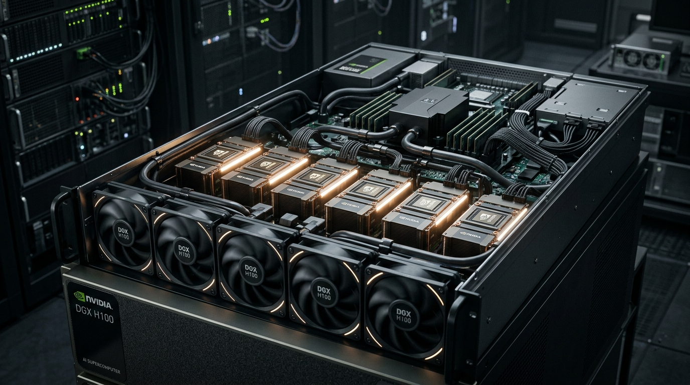

# 🚀 NVIDIA Hopper 아키텍처 (H100 & H200)

NVIDIA Hopper 아키텍처는 거대 언어 모델(LLM)의 급격한 성장을 주도하고 전 세계 초거대 AI 학습 인프라의 표준을 정립한 베스트셀러 가속기 플랫폼입니다.

---

## 1. Hopper 아키텍처 개요
Hopper 아키텍처는 기존 Ampere(A100) 대비 최대 9배의 AI 학습 성능과 30배의 LLM 추론 성능 향상을 달성했습니다.

* **Transformer Engine (트랜스포머 엔진):** FP8(8비트 부동소수점)과 FP16 연산을 실시간으로 혼합 지원하여, 연산 정밀도 저하 없이 학습 및 추론 속도를 혁신적으로 향상시켰습니다.
* **H100 vs H200 차이점:**
  * **H100:** TSMC 4N 공정 기반, 80GB HBM3 탑재 (3.35TB/s 대역폭).
  * **H200:** H100과 핀 호환(Pin-compatible)이 가능한 개량 버전으로, 업계 최초로 **141GB HBM3e** 메모리를 장착하여 용량을 1.7배, 대역폭을 4.8TB/s로 크게 향상시켜 대규모 LLM 추론 성능을 고도화했습니다.

---

## 2. 서버 시스템 구성 (NVIDIA DGX H100)
NVIDIA Hopper 8개 카드가 완전한 시스템으로 조립된 레퍼런스 서버 **NVIDIA DGX H100**의 모습입니다.



---

## 3. 하드웨어 Teardown 및 구성 부품 분석

DGX H100 8-GPU 서버 섀시를 완전히 분해(Teardown)했을 때 구성되는 주요 모듈과 핵심 부품 분석 정보입니다.

```
+-------------------------------------------------------------------+
|                  DGX H100 서버 섀시 내부 레이아웃                 |
|                                                                   |
|   [ 전면 팬 냉각부 ] --> 8개의 대형 섀시 쿨링 팬                    |
|                                                                   |
|   +-----------------------------------------------------------+   |
|   |         GPU Universal Baseboard (UBB / 메인 기판)          |   |
|   |                                                           |   |
|   |  [SXM5 GPU 1] [SXM5 GPU 2] [SXM5 GPU 3] [SXM5 GPU 4]      |   |
|   |  [SXM5 GPU 5] [SXM5 GPU 6] [SXM5 GPU 7] [SXM5 GPU 8]      |   |
|   |                                                           |   |
|   |  * 하단에 4개의 NVSwitch 기판 및 통신 버스 기판 적층       |   |
|   +-----------------------------------------------------------+   |
|                                                                   |
|   +-----------------------------------------------------------+   |
|   |                    CPU Host Motherboard                   |   |
|   |  - Dual Intel Xeon Gen 4 CPUs  - DDR5 RAM  - PCIe Gen 5   |   |
|   +-----------------------------------------------------------+   |
|                                                                   |
|   [ 후면 전원 및 네트워킹 ] --> 6x 3,300W 파워팩, PCIe 확장 슬롯     |
+-------------------------------------------------------------------+
```

### ① GPU OAM (SXM5) 모듈 카드
* **칩셋 명세:** TSMC 4N 공정에서 제조된 Hopper GPU 다이(Die)와 5개 또는 6개의 HBM3/HBM3e 메모리 적층 칩이 TSMC CoWoS 2.5D 패키징을 통해 하나의 OAM(Open Accelerator Module) 보드로 일체화되어 있습니다.
* **SXM5 규격:** 기존 PCIe 슬롯 타입 카드와 달리 메인 기판(UBB)에 고밀도로 직접 부착되는 메자닌 커넥터 형태로, 카드당 최대 700W의 전력을 소모합니다.

### ② UBB (Universal Baseboard / GPU 메인보드)
* **스펙:** 8개의 SXM5 GPU 모듈이 결합하는 거대한 백플레인 기판입니다.
* **핵심 설계:** GPU 간의 초고속 PCIe Gen 5 및 NVLink 4 신호 라인이 조밀하게 라우팅되어 있습니다. 고속 전송 신호의 왜경과 감쇠를 방지하기 위해 **Ultra-low loss 초고다층 PCB(24층 이상)**가 사용됩니다.

### ③ NVSwitch 통신 스위치 기판
* **스펙:** 서버 섀시 하단에 독립된 통신 스위칭 기판이 적층되어 있으며, 총 4개의 **NVSwitch 3** 칩셋이 탑재됩니다.
* **기능:** 8개의 GPU가 서로 900GB/s의 대역폭으로 완전히 메쉬(Mesh) 형태로 상호 연결되어 병목 없이 데이터를 실시간으로 주고받을 수 있게 제어합니다.

### ④ CPU 호스트 마더보드
* **스펙:** AI 서버 전체를 부팅하고 OS를 관리하며 GPU에 데이터를 피딩(Feeding)하는 주 연산 보드입니다.
* **장착 부품:** 2개의 Intel Xeon Platinum 8480C 프로세서와 DDR5 시스템 메모리, PCIe 스위치 칩이 내장되어 있습니다.

### ⑤ 전력 및 섀시 냉각 솔루션
* **파워 서플라이 (PSU):** 서버 후면에 3,300W(80+ Titanium 규격) 파워 서플라이 모듈이 총 6개 핫스왑 형태로 배치되어 있으며, N+N 이중화(Redundancy)를 지원해 최대 9,900W의 정격 전력을 상시 공급합니다.
* **공랭 시스템 (Air Cooling):** DGX H100은 대부분 대형 섀시 팬과 각 GPU 모듈에 밀착된 초대형 구리 증기챔버(Vapor Chamber) 히트싱크를 결합한 공랭식 냉각 방식을 기본 채택하고 있습니다. (일부 커스텀 랙의 경우 액체 냉각 개조가 수행됩니다.)

---

## 4. 핵심 밸류체인 및 부품 공급망 분석

Hopper 서버 제조에 들어가는 대표 부품과 글로벌/국내 주요 밸류체인 제조 명세입니다.

| 부품 카테고리 | 세부 구성품 | 주요 핵심 공급 공급망 |
| :--- | :--- | :--- |
| **Foundry** | GPU 웨이퍼 위탁 생산 | **TSMC** (대만) |
| **Packaging** | 2.5D 어드밴스드 패키징 | **TSMC (CoWoS)** |
| **HBM Memory** | HBM3 / HBM3e 메모리 공급 | **SK하이닉스** (주력), **삼성전자**, **Micron** |
| **HDI / PCB 기판** | UBB 및 NVSwitch 다층 기판 | **이수페타시스** (국내), **Wus Printed Circuit** (대만) |
| **FC-BGA Substrate** | 칩셋 패키징용 하이엔드 기판 | **Ibiden** (일본), **Shinko** (일본), **삼성전기** (국내) |
| **Power Supply** | 3300W 서버 파워 팩 | **Delta Electronics** (대만), **Lite-On** (대만) |
| **Connectors** | 고속 메자닌 및 버스바 커넥터 | **Amphenol** (미국), **Molex** (미국) |
| **Cooling Block** | 구리 증기 챔버 및 히트싱크 | **Auras** (대만), **Cooler Master** (대만) |
