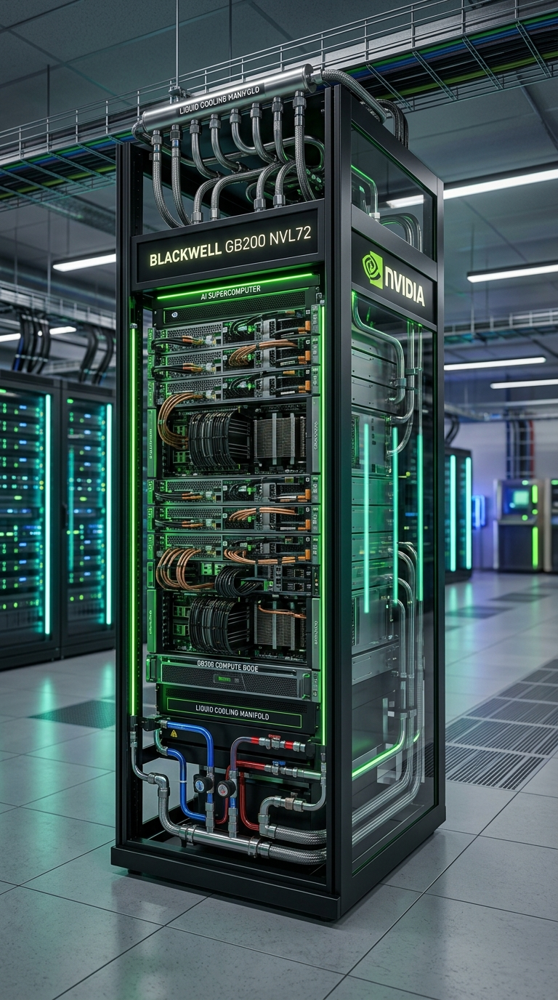

# 🟢 NVIDIA AI 가속기 플랫폼 로드맵

NVIDIA는 AI 가속기 단품칩 설계뿐만 아니라, 시스템 마더보드, NVLink 스위치 네트워크, 전원 제어, 액체 냉각 솔루션을 단일 랙(Cabinet) 형태로 통합하여 제공하는 '랙 스케일 아키텍처'로 하이엔드 AI 인프라의 표준을 선도하고 있습니다.

---

## 1. 대표 플랫폼 이미지
NVIDIA AI 인프라의 최신 표준을 상징하는 **GB200 NVL72 액체 냉각 랙**입니다.

---

## 2. NVIDIA 아키텍처 로드맵 요약
아래 각 아키텍처명을 클릭하시면 **서버 실물 사진 및 세부 Teardown 분석 명세**를 확인하실 수 있습니다.

| 출시 연도 | 아키텍처 세대명 | 주력 연산 칩셋 | 메모리 지원 사양 | 주요 특징 및 네트워킹 스케일 |
| :--- | :--- | :--- | :--- | :--- |
| **2023** | [**Hopper**](/nvidia-hopper) | H100 / H200 | 80GB HBM3 / 141GB HBM3e | 대규모 LLM 학습을 독점한 스테디셀러. NVLink 4 (900GB/s) |
| **2024~2025** | [**Blackwell**](/nvidia-blackwell) | B100 / B200 / GB200 | 192GB / 384GB HBM3e | 듀얼 다이 패키징 칩셋. 랙 단위 액체 냉각 및 수직 구리 버스바 탑재 |
| **2026 (E)** | [**Rubin**](/nvidia-rubin) | R100 / GR200 | 2048-bit HBM4 (12/16단) | 3nm 미세공정 및 실리콘 포토닉스(CPO) 광학 인터커넥트 아키텍처 |

---

## 3. 핵심 아키텍처 세대간 스펙 비교

| 비교 분류 | Hopper (H200) | Blackwell (B200) | Rubin (R100) |
| :--- | :--- | :--- | :--- |
| **공정 (Foundry)** | TSMC 4N (5nm 개량) | TSMC 4NP (4nm 개량) | TSMC 3nm 이하 |
| **패키징 기술** | 2.5D CoWoS-S | 2.5D CoWoS-L (듀얼 다이) | 3D 하이브리드 본딩 (SoIC) |
| **최대 연산 (FP8)** | 2.0 PFLOPS | 4.5 PFLOPS | 9.0 PFLOPS 이상 (예측) |
| **메모리 유형** | HBM3e (1024-bit) | HBM3e (1024-bit) | **HBM4 (2048-bit)** |
| **메모리 대역폭** | 4.8 TB/s | 8.0 TB/s | 12.0 TB/s 이상 (예측) |
| **대표 냉각 기술** | 대형 증기 챔버 공랭식 | 랙 매니폴드 액체 냉각식 | CPO 광학 및 비전도성 액체 냉각 |
