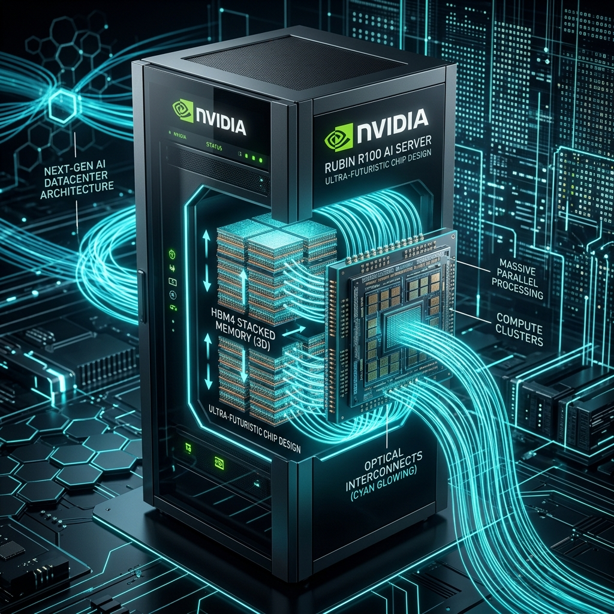

# 🔵 NVIDIA Rubin 아키텍처 (R100 & GR200)

NVIDIA Rubin 아키텍처는 2026년 이후 출시될 예정인 차세대 AI 가속기 플랫폼입니다. 최초로 **HBM4(4세대 고대역폭 메모리)** 인터페이스를 채택하고 광통신(Silicon Photonics)을 연계하여 메모리와 통신 대역폭의 물리적 한계를 완전히 극복하는 것을 목표로 설계되고 있습니다.

---

## 1. Rubin 아키텍처 개요
Rubin 아키텍처는 Blackwell 대비 미세 공정의 전환과 3차원 적층 패키징의 고도화를 지향합니다.

* **TSMC 3nm 이하 미세공정:** 기존 TSMC 4N 공정에서 한 단계 더 도약해 3nm 또는 2nm 이하의 초미세 공정을 활용하여 극대화된 전력 효율성과 트랜지스터 밀도를 확보합니다.
* **HBM4 메모리 표준:** HBM3e까지의 1024-bit 전송 대역폭 한계를 깨고, 최초로 **2048-bit 인터페이스의 HBM4** 메모리 칩셋을 다이렉트로 탑재합니다.
* **GR200 및 Rubin GPU:** 차세대 Vera CPU 또는 기존 Grace CPU의 후속 플랫폼과 Rubin GPU가 결합되어, 인공지능 자율 연산 수준을 극대화합니다.

---

## 2. 서버 시스템 구성 (NVIDIA Rubin Concept)
차세대 광학 NVLink 인터커넥터와 초고밀도 액체 냉각 채널이 내장될 **NVIDIA Rubin 서버 인프라 컨셉**의 모습입니다.



---

## 3. 하드웨어 Teardown 예측 및 시스템 아키텍처

Rubin 플랫폼은 아직 양산 전 단계이나, 유출된 세부 아키텍처 제안서와 OCP(Open Compute) 발전 기조를 기반으로 실물 분해(Teardown)에 필적하는 시스템 구성 모듈 예측 명세를 수록합니다.

```
+-------------------------------------------------------------------+
|                  Rubin 차세대 AI 랙 캐비닛 예측 레이아웃             |
|                                                                   |
|   +-----------------------------------------------------------+   |
|   |         Rubin Optical Compute Trays (광통신 기판 슬롯)     |   |
|   |  - R100 GPU (3nm 미세화 공정 적용)                         |   |
|   |  - GPU 다이 바로 위에 HBM4 메모리가 3D 적층된 턴키 구조     |   |
|   |  - 실리콘 포토닉스(Silicon Photonics) 광 트랜시버 모듈      |   |
|   +-----------------------------------------------------------+   |
|                                                                   |
|   +-----------------------------------------------------------+   |
|   |         CPO (Co-Packaged Optics) 스위치보드               |   |
|   |  - 구리 구부림 구속 탈피, 광섬유 패치 코드로 GPU-GPU 직결   |   |
|   +-----------------------------------------------------------+   |
|                                                                   |
|   [ 하이퍼 쿨링 매니폴드 ] --> 특수 절연 비전도성 액체 냉각 배관     |
|                                                                   |
|   [ 스마트 파워 셸프 ] --> AI 워크로드 기반 동적 전력 분배 제어     |
+-------------------------------------------------------------------+
```

### ① 3D 패키징 및 HBM4 적층 모듈 (R100 GPU)
* **스펙:** HBM4부터는 메모리 베이스 다이(Base Die)를 기존의 메모리 공정이 아닌 **TSMC 3nm 미세 파운드리 공정**으로 직접 생산해 GPU 로직 다이 위에 3D 적층합니다.
* **효과:** 메모리와 연산 유닛 간의 결합 밀도가 압도적으로 높아져 신호 지연시간이 거의 제로에 수렴하게 되며, 기판 실장 면적이 획기적으로 줄어듭니다.

### ② 실리콘 포토닉스 광통신 기판 (Silicon Photonics)
* **특징:** Rubin 세대부터는 고주파 구리 케이블을 통한 전기 신호 전송의 물리적 저항 한계(발열 및 속도 저하)를 극복하기 위해, 전기 대신 빛을 통해 통신하는 **CPO(Co-Packaged Optics)** 기술이 컴퓨트 트레이에 내장됩니다.
* **구성:** 광섬유 커넥터가 GPU 모듈 보드 바로 옆에 실장되어, 스위치 랙으로 빛 신호 데이터를 직접 송수신합니다.

### ③ 비전도성 직접 액체 냉각 (Direct Liquid Cooling with Dielectric Fluid)
* **스펙:** 랙당 발열량이 Blackwell(120kW)을 가볍게 상회하여 **140kW~200kW**에 이를 것으로 전망됨에 따라, 일반 정제 냉각수가 아닌 전류가 흐르지 않는 비전도성 특수 액체(Dielectric Fluid)를 냉각 루프에 도입할 것으로 예측됩니다.

---

## 4. Rubin 핵심 밸류체인 및 공급망 예측

차세대 Rubin 플랫폼 양산 시 핵심 공급망을 주도할 플레이어들의 가치 사슬 포지션입니다.

| 부품 영역 | 핵심 구성품 및 사양 | 핵심 예측 공급망 플레이어 |
| :--- | :--- | :--- |
| **반도체 생산** | R100 GPU 3nm 이하 웨이퍼 | **TSMC** (대만) |
| **Advanced Packaging** | 3D 하이브리드 본딩 (SoIC 기술) | **TSMC** (대만) |
| **HBM4 Memory** | 2048-bit 베이스 다이 및 메모리 적층 | **SK하이닉스** (주도), **삼성전자** (Turnkey 강점), **Micron** |
| **광통신 모듈** | 실리콘 포토닉스 광 트랜시버 모듈 | **Broadcom** (미국), **Intel** (미국), **Coherent** (미국) |
| **초고다층 기판** | 광통신 융합 백플레인 및 CPO PCB | **이수페타시스** (국내), **Ibiden** (일본) |
| **액체 냉각 제어** | 초고밀도 매니폴드 및 스마트 CDU | **Vertiv** (미국), **nVent** (미국) |
| **랙 전력 공급** | 100kW+ 대응 초고출력 PSU 시스템 | **Delta Electronics** (대만), **삼성전기** (국내) |
