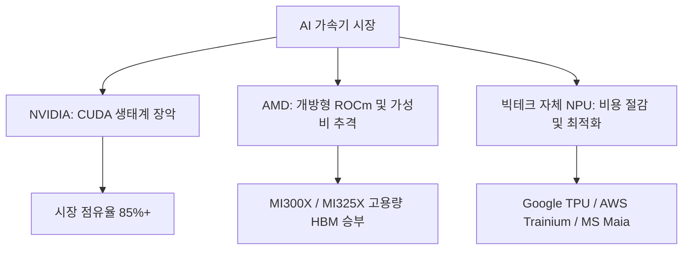

# 📊 Step 2. 시장 인사이트 & Leading 기업 (Market Insights)

AI 서버 산업은 특정 선도 기업들의 독점적인 핵심 기술과 복잡하게 얽힌 글로벌 서플라이 체인(Supply Chain)을 중심으로 급변하고 있습니다. 이 페이지에서는 주요 핵심 영역별 선도 기업들의 포지셔닝과 시장 기회를 심층 분석합니다.

---

## 칩셋 (AI Accelerator) 시장 구도
현재 AI 가속기 시장은 독점적 강자와 강력한 도전자들 간의 생태계 경쟁 구도입니다.

### 1. NVIDIA (독점적 시장 지배자)
* **시장 포지션:** 글로벌 점유율 **85~90%** 차지.
* **핵심 경쟁력:**
  * **CUDA (Compute Unified Device Architecture):** 15년 이상 축적된 개발자 소프트웨어 생태계로, AI 개발 코드가 NVIDIA 칩셋에 완벽히 최적화되어 있어 타 칩셋으로의 전환 장벽(Switching Barrier)이 극도로 높음.
  * **네트워킹 통합:** Mellanox 인수를 통해 확보한 **InfiniBand** 및 **NVLink** 네트워킹 기술로, 수만 개의 GPU를 연결하여 단일 슈퍼컴퓨터처럼 작동시키는 클러스터링 기술력 독보적.
* **주요 과제:** 높은 칩 가격(단일 서버 랙 수십억 원 선) 및 공급 부족으로 인한 빅테크 기업들의 자립화 시도 대응.

### 2. AMD (가장 현실적인 대안)
* **시장 포지션:** 글로벌 점유율 약 **10%** 내외로 추격 중.
* **핵심 경쟁력:**
  * **압도적인 메모리 스펙:** MI300X 및 MI325X 등에서 NVIDIA 경쟁 칩 대비 더 큰 용량과 넓은 대역폭의 HBM 메모리를 탑재하여 가성비와 초대형 모델 메모리 여유 제공.
  * **ROCm 개방형 생태계:** NVIDIA CUDA에 대항하여 오픈 소스 소프트웨어 플랫폼 개발에 총력, PyTorch 등 주요 프레임워크와의 호환성을 극대화하여 마이그레이션 장벽을 지속적으로 낮춤.

### 3. Big Tech CSP (자체 칩 내재화)
* **주요 주체:** Google, Amazon (AWS), Microsoft, Meta 등.
* **추진 동기:** NVIDIA GPU의 엄청난 도입 단가 및 전력 소비 절감, 특정 서비스(검색, 광고 추천 등)에 최적화된 설계 적용.
* **대표 가속기:** Google **TPU v5p/v6**, AWS **Trainium2 / Inferentia2**, Microsoft **Maia 100**.

---

## 2. 파운드리 & 어드밴스드 패키징 (TSMC CoWoS)
AI 가속기 칩 생산의 절대적 병목은 실리콘 웨이퍼 미세 공정뿐만 아니라, GPU와 HBM을 물리적으로 결합하는 **어드밴스드 패키징(Advanced Packaging)** 공정에 있습니다.

| 패키징 기술명 | 주관사 | 설명 및 영향력 |
| :--- | :--- | :--- |
| **CoWoS (Chip-on-Wafer-on-Substrate)** | **TSMC** (대만) | GPU 연산 코어와 여러 개의 HBM 칩을 인터포저(Interposer)라는 실리콘 판 위에 미세하게 연결해 얹는 2.5D 패키징 기술. 사실상 NVIDIA Blackwell 등 하이엔드 AI 가속기의 생산량은 TSMC의 CoWoS 캐파(Capacity)에 완전히 종속됨. |
| **I-Cube / X-Cube** | **삼성전자** | 삼성전자가 자체 개발한 2.5D 및 3D 패키징 솔루션으로, HBM 칩 생산부터 패키징까지 일괄 제공하는 **Turnkey(턴키) 서비스**로 시장 점유율 확대를 꾀함. |

---

## 3. HBM (High Bandwidth Memory) 공급망
HBM은 D램 칩을 수직으로 적층하여 데이터 전송 통로(TSV)를 수천 개 뚫어 대역폭을 극대화한 초고속 메모리입니다. AI 가속기의 병목 해소를 위한 필수 부품입니다.

* **SK하이닉스 (시장 선두 주자):**
  * 독자적인 **MR-MUF (Mass Reflow Molded Underfill)** 공정 기술을 앞세워 Blackwell 등 NVIDIA 차세대 라인업의 주력 공급사 지위 유지. 열 방출과 생산 수율 면에서 선제적 도달.
* **삼성전자 (격렬한 추격):**
  * 12단 적층 HBM3e 등의 초대용량 포트폴리오를 기반으로 공급망 진입 가속화. 세계 최대 메모리 생산 캐파를 강점으로 대량 공급 시장 준비.
* **Micron (제3의 플레이어):**
  * 미국 본토 생산 및 정부 지원을 등에 업고 HBM3e 시장에 진입하여 공급선 다변화 수혜 획득.

---

## 💡 종합 마켓 인사이트
AI 서버 시장은 단순한 하드웨어 조립 시장이 아닌 **[설계(NVIDIA) - 미세공정 및 패키징(TSMC) - 메모리(SK하이닉스/삼성) - 인프라 조립(Foxconn/Quanta)]**로 이어지는 초정밀 가치 사슬입니다. 2026년 현재 HBM과 어드밴스드 패키징 공급 이슈가 해소됨에 따라 전력 공급 인프라 및 수랭식 냉각(Liquid Cooling)이 새로운 하드웨어 서플라이 체인의 핵심 병목이자 투자 기회로 떠오르고 있습니다.
