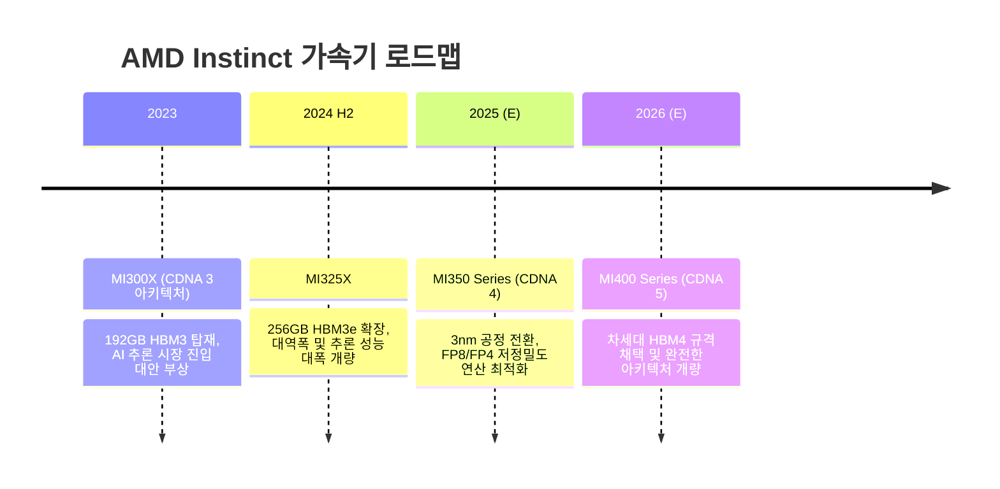

# 🗺️ Step 3. 주요 기업 플랫폼 로드맵 (Enterprise Roadmap)

글로벌 테크 거인들은 초거대 생성형 AI 모델의 연산 요구치 급증에 발맞춰 하드웨어 칩셋 및 플랫폼 출시 주기를 기존 2년에서 **1년 단위**로 대폭 단축하고 있습니다. 업계 주요 플레이어들의 가속기 및 서버 플랫폼 개발 로드맵을 정리합니다.

---

## 🟢 NVIDIA 가속기 플랫폼 로드맵
NVIDIA는 고성능 연산 장치 뿐만 아니라 고속 스위치, 냉각 인프라를 통합 랙(Rack) 솔루션 단위로 설계하여 시장의 표준을 선도하고 있습니다.

| 출시 연도 | 아키텍처명 | 대표 가속기 명칭 | 메모리 사양 | 네트워킹 및 통합 스케일 | 주요 특징 |
| :--- | :--- | :--- | :--- | :--- | :--- |
| **2023** | [**Hopper**](/nvidia-hopper) | H100 / H200 | 80GB HBM3 / 141GB HBM3e | NVLink 4 (900GB/s) | 대규모 LLM 학습 시장을 독점 개화시킨 베스트셀러 플랫폼 |
| **2024 ~ 2025** | [**Blackwell**](/nvidia-blackwell) | B100 / B200 / GB200 | 192GB / 384GB HBM3e | NVLink 5 (1.8TB/s) | 단일 다이에 2개 칩셋을 집적한 형태. GB200 NVL72 액체냉각 시스템 본격 도입 |
| **2026 (E)** | [**Rubin**](/nvidia-rubin) | R100 / GR200 | HBM4 (12단/16단 적층) | NVLink 6 (초고속 대역폭) | 차세대 HBM4 3D 적층 메모리 표준 채택, 3nm 이하 초미세 공정 적용 예정 |

### 💡 NVIDIA 플랫폼 로드맵의 지향점
NVIDIA는 단순 단품 가속기 판매에서 벗어나 72개의 Blackwell GPU와 36개의 Grace CPU를 액체 냉각 배관과 함께 하나의 통합 캐비닛(Rack)으로 구성한 **GB200 NVL72**와 같은 초거대 랙 스케일 아키텍처로 진화하고 있습니다.

---

## 🔴 AMD Instinct 로드맵
AMD는 업계 최고의 고대역폭 메모리 용량과 개방형 생태계를 앞세워 NVIDIA의 통합 독점 구도에 균열을 내고 있습니다.

* **MI300X (2023):** 경쟁 제품인 H100 대비 더 저렴한 가격에 더 큰 메모리 버퍼를 지원하여 Llama-3 등의 대형 오픈소스 모델 추론 인프라 구축의 대안으로 부각.
* **MI325X (2024 H2):** 256GB HBM3e를 탑재해 초거대 AI 모델 서빙 성능을 업그레이드하고 양산 돌입.
* **MI350 시리즈 (2025 예정):** 차세대 CDNA 4 아키텍처 기반으로 메모리 성능을 확대하고 미세공정 효율을 끌어올려 NVIDIA Blackwell과 정면 대결.

---

## 🔵 Intel 가속기 & 가성비 추격
인텔은 전통의 CPU 절대 강자에서 가속기 시장에서의 점유율 확보를 위해 투 트랙 전략을 실행하고 있습니다.

1. **Gaudi (가우디) 가성비 가속기 라인업:**
   * **Gaudi 3 (2024):** 5nm 공정 기반으로 제작되어 고성능 연산 대비 경쟁사 GPU의 절반 이하 가격이라는 파격적인 가성비 전략 구사. 특히 대규모 커스텀 AI 모델 인프라에 적합.
2. **Falcon Shores (팔콘 쇼어) 통합 플랫폼 (2025/2026 예정):**
   * 인텔의 GPU 아키텍처(Xe)와 Gaudi의 장점을 융합하여 개발 중인 진정한 차세대 AI 통합 가속기. 인텔의 차세대 공정 18A 적용 가능성 제기.

---

## 🟡 빅테크 CSP 자체 가속기 (ASIC / TPU)
* **Google (TPU v5p -> v6):** AI 학습에 독보적인 효율을 자랑하는 TPU 생태계 구축. 특히 구글의 자체 거대 인공지능인 Gemini 시리즈는 전적으로 TPU 클러스터에서 학습 및 배포됨.
* **AWS (Trainium 2):** 아마존 웹 서비스 이용 기업 고객들에게 최저가 학습 비용을 제안하기 위한 용도로, 인공지능 클러스터 랙 스케일 솔루션인 EC2 UltraCluster와 연계 구성.
